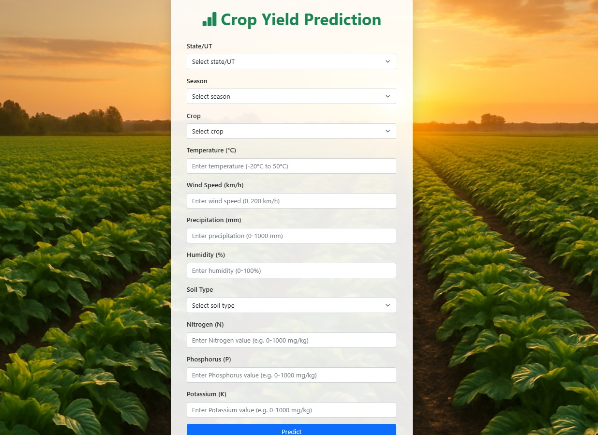
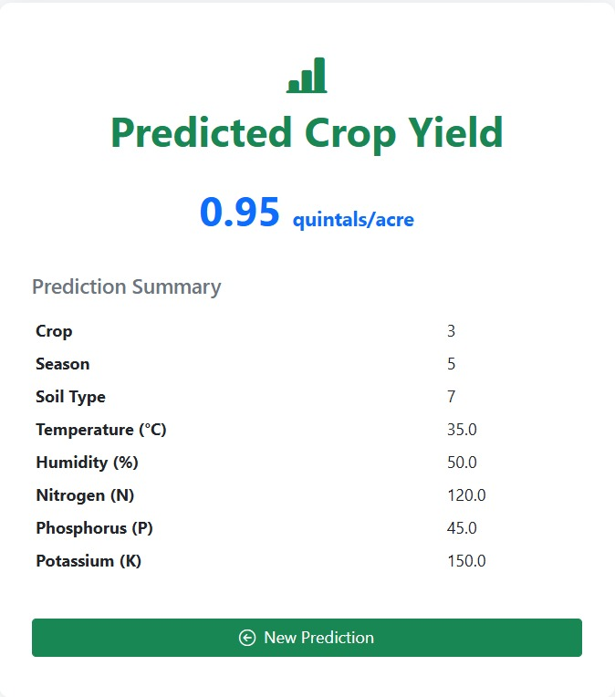

# Crop Yield Prediction Project


## Overview
This project is a web-based Crop Yield Prediction system that leverages machine learning (XGBoost) to predict expected crop yield per acre based on user inputs such as location, season, crop type, weather, and soil parameters. It features a modern, responsive UI and robust backend validation for a seamless user experience.

## Features
- Predict crop yield (quintals/acre) using a trained XGBoost model
- User-friendly web interface built with Flask and Bootstrap
- Input validation and helpful error messages
- Responsive design for desktop and mobile
- Easy extensibility for new crops, locations, or features


## Setup Instructions
1. **Clone the repository:**
   ```bash
   git clone https://github.com/surajrao2003/Crop-Yield-Prediction-Project.git
   cd Crop-Yield-Prediction-Project
   ```
2. **Install dependencies:**
   ```bash
   pip install -r requirements.txt
   ```
3. **Ensure the model file exists:**
   - `xgboost_yield_prediction_final.pkl` should be present in the root directory.
4. **Run the web app:**
   ```bash
   python app.py
   ```

## Usage
- Fill out the form fields for state, season, crop, temperature, wind speed, precipitation, humidity, soil type, and NPK values.
- Click **Predict** to get the expected yield in quintals per acre.
- If any input is invalid, helpful error messages will be shown.

## User Interface Screenshots

**Main Input Form:**



**Prediction Output Example:**



## Project Structure
```
├── app.py                  # Flask backend
├── xgboost_yield_prediction_final.pkl  # Trained ML model
├── templates/
│   ├── index.html          # Main input form
│   ├── predict.html        # Prediction result page
│   └── error.html          # Error page
├── complete_dataset.csv    # (Optional) Source data
├── final_code.ipynb        # (Optional) Model training notebook
├── README.md
└── requirements.txt        # Python dependencies
```

## Requirements
- Python 3.8+
- Flask
- numpy, pickle, xgboost (for model training, already trained model provided)


## Documentation
- [Project PPT](https://docs.google.com/presentation/d/1R2g8fT5vu0ekczgj63kaKl4AvXaXXtVP/edit?usp=drive_link&ouid=105191186790125380243&rtpof=true&sd=true)
- [Project Report](https://drive.google.com/file/d/19vTs4eBYXePk7JsEiQ9a6WdTsmzOuTMp/view?usp=drive_link)